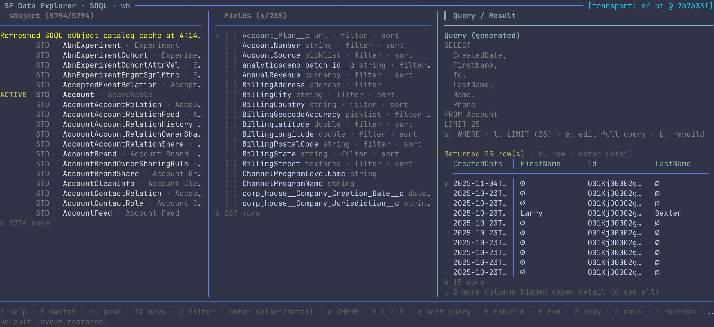
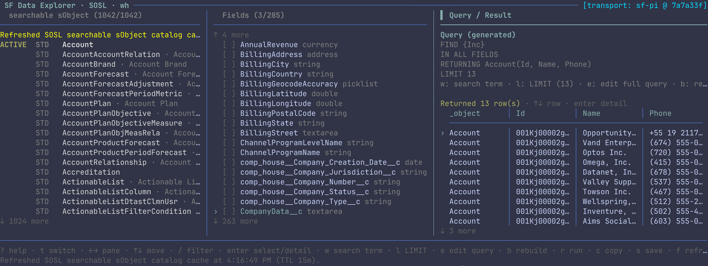
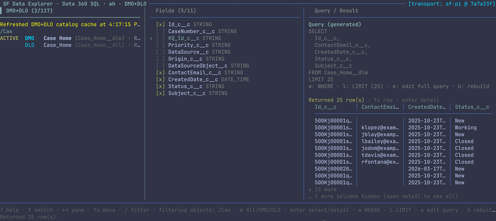

# SF Data Explorer

Read-only interactive Salesforce data explorer for pi.

## Screenshots

Below are recent screenshots demonstrating the TUI for each mode (SOQL, SOSL, Data 360 SQL). The images are included in the repository at assets/screenshots/.

### SOQL (select fields, run SOQL)



### SOSL (search across objects)



### Data 360 SQL (DMO/DLO)



## Commands

```text
/sf-data-explorer soql my-org
/sf-data-explorer sosl my-org
/sf-data-explorer sql my-org

# Deep-link to an object/table and org:
/sf-data-explorer soql Account my-org
/sf-data-explorer sosl Contact my-org
/sf-data-explorer sql Account_Home my-org
```

Modes:

- `soql` — browse queryable core Salesforce sObjects, select fields, edit/run SOQL.
- `sosl` — browse searchable/queryable core Salesforce sObjects, build/edit/run SOSL.
- `sql` — browse Data 360 DMO/DLO catalogs, select fields, edit/run Data 360 SQL.

The extension uses sf-pi's `@salesforce/core` connection plumbing through dynamic imports. It does not shell out to `sf` for REST calls and does not require an LLM for normal use.

## Keyboard

- `?` — show shortcut help
- `t` — switch between SOQL, SOSL, and Data 360 SQL explorers
- `←` / `→` — move panes
- `↑` / `↓` — move selection
- `/` — filter object or field pane
- `enter` / `space` — select object, toggle field, open row detail
- `w` — edit WHERE/search term
- `l` — edit LIMIT
- `e` — edit full query text in-place (enter saves, esc cancels; arrows move across lines)
- `b` — rebuild query from selections
- `r` — run current query text
- `c` — close explorer and copy query to pi editor
- `s` — open in-TUI save menu for JSON/CSV under `.sf-data-explorer/exports/`; stays in explorer after saving
- `f` — refresh catalog/fields
- `z` — toggle focus layout
- `v` — toggle columns/accordion
- `q` / `esc` — close/back

## Safety

First iteration is read-only. SOQL/Data 360 SQL must start with `SELECT`; SOSL must start with `FIND`. Results can be exported under `.sf-data-explorer/exports/`.

## Development

```bash
npm install
npm run typecheck
npm test
```

The test suite covers command parsing, SOQL/SOSL/Data 360 SQL builders, read-only validators, result normalization, export helpers, and mocked transport endpoint usage.
